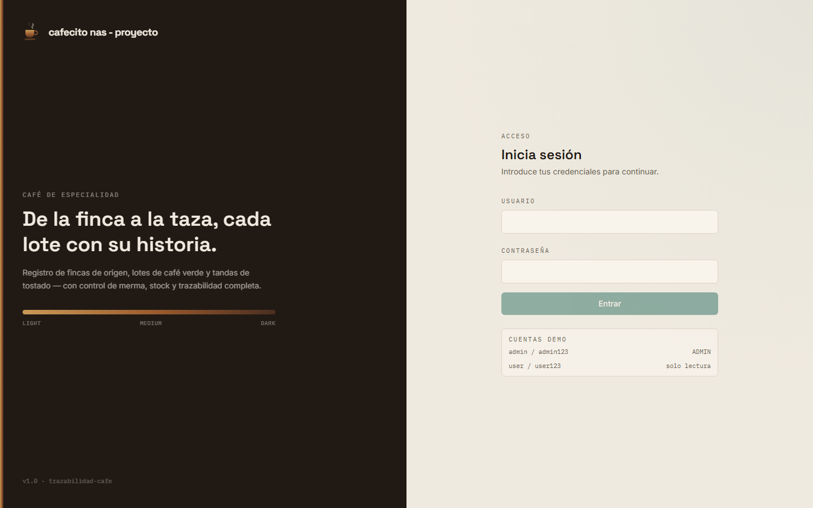
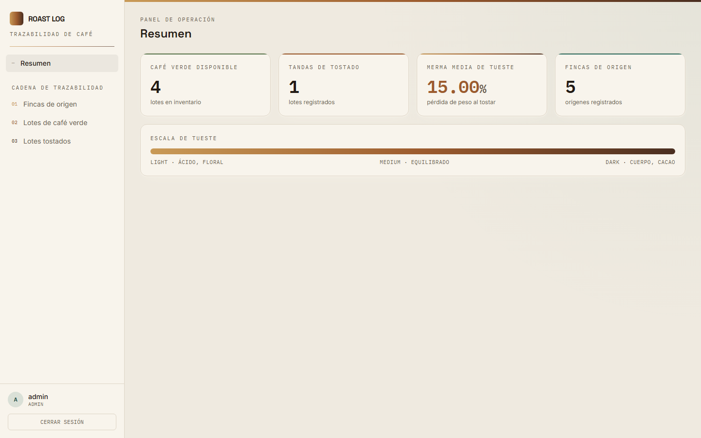
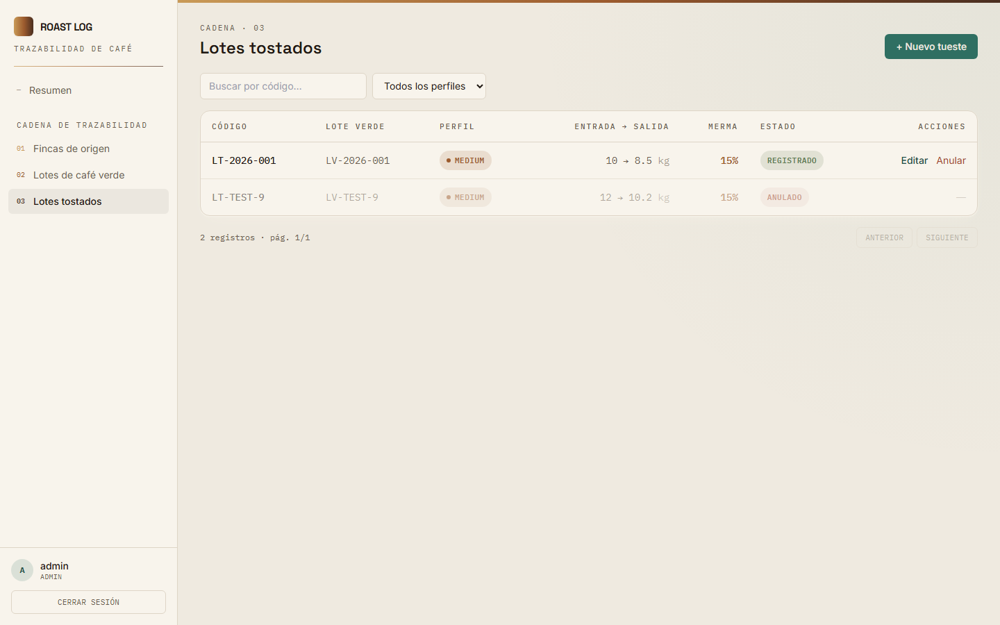

# ☕ Roast Log — Trazabilidad de Café de Especialidad

Mantenimiento (CRUD) full‑stack que modela la trazabilidad real del café **"de la finca a la taza"**:

```
Finca (origen)  →  Lote de café verde  →  Lote tostado
```

Cada eslabón se registra con sus reglas de negocio: control de **stock**, cálculo de **merma de tueste**,
estados y **anulación con devolución de stock**. Incluye **autenticación JWT por roles** y **documentación OpenAPI**.



---

## 🧱 Stack

| Capa | Tecnología |
|---|---|
| **Frontend** | Angular 20 (standalone + signals) · TypeScript · **Tailwind CSS** (sistema de diseño propio "Roast Log") |
| **Backend** | Java 21 · Spring Boot 3.3 · arquitectura por capas (Controller → Service → Repository) |
| **Seguridad** | Spring Security + **JWT** (HS256, BCrypt) · roles `ADMIN` / `USER` |
| **Persistencia** | Spring Data JPA · **Flyway** (migraciones versionadas) |
| **Base de datos** | PostgreSQL 16 |
| **Docs API** | springdoc‑openapi (Swagger UI) |
| **Mapeo / Tests** | MapStruct · JUnit 5 + Mockito |

---

## ✨ Mejoras incorporadas (más allá del CRUD base)

- **Spring Security + JWT** con autorización por rol: `ADMIN` escribe, `USER` solo lee (verificable en UI y API).
- **Reglas de negocio reales** en el servidor: merma `= (entrada − salida) / entrada × 100`, control de stock del
  lote verde, transición a `AGOTADO`, y anulación que **devuelve el peso** al stock.
- **Flyway** para esquema + datos semilla reproducibles.
- **Swagger/OpenAPI** con esquema de seguridad Bearer para probar la API autenticada.
- **Manejo global de errores** con respuesta JSON consistente y códigos correctos (400 / 401 / 403 / 404 / 409).
- **Diseño de UI intencional** (no plantilla genérica): identidad de tostaduría, tipografía Space Grotesk +
  IBM Plex Mono, y un **espectro de tueste** funcional que codifica los perfiles Light / Medium / Dark.
- **Docker Compose (virtualización):** un único `docker compose up` levanta BD + backend + frontend detrás de
  **una sola URL** (nginx sirve la SPA y hace de proxy a la API). Sin instalar nada más.

---

## 📸 Vistas

| Dashboard | Lotes tostados |
|---|---|
|  |  |

---

## ✅ Requisitos

- **Java 21** y **Maven 3.9+**
- **Node 20+** y **npm** (probado con Node 24)
- **PostgreSQL 16** accesible en `localhost`

---

## 🚀 Puesta en marcha

### Opción A — Docker 🐳 (recomendado: un comando, una sola URL)

Requiere Docker Desktop. Desde la raíz del proyecto:

```bash
docker compose up --build
```

Luego abre **http://localhost:8080** y listo. Un contenedor **nginx** sirve la SPA Angular y reenvía `/api`
al backend; **PostgreSQL** se levanta y se siembra solo con Flyway. No hay que abrir varios puertos: **todo
(app + API + Swagger en `/swagger-ui.html`) vive tras esa única URL**. Para detener: `docker compose down`
(añade `-v` para borrar también el volumen de datos).

### Opción B — Nativo (sin Docker)

> En modo nativo el frontend (live‑reload) y la API corren por separado: app en `:4200`, API en `:8080`.

#### 1. Base de datos

```sql
CREATE DATABASE cafe_trazabilidad;
CREATE USER cafe WITH PASSWORD 'cafe';
GRANT ALL PRIVILEGES ON DATABASE cafe_trazabilidad TO cafe;
```

> **Puerto:** por defecto el backend usa `5432`. Si tu PostgreSQL escucha en otro puerto, arráncalo con la
> variable `DB_PORT` (p. ej. `DB_PORT=5433 mvn spring-boot:run`). Credenciales/puerto se pueden ajustar en
> `backend/src/main/resources/application.yml` o por variables de entorno (`DB_USER`, `DB_PASSWORD`, `DB_PORT`).

#### 2. Backend

```bash
cd backend
mvn spring-boot:run
```

- API:  `http://localhost:8080`
- Swagger UI:  `http://localhost:8080/swagger-ui.html`
- **Flyway** crea el esquema y carga los datos demo automáticamente en el primer arranque.

#### 3. Frontend

```bash
cd frontend
npm install
npm start
```

- App:  `http://localhost:4200` (el dev‑server hace proxy de `/api` → `:8080`).

---

## 🔐 Credenciales demo

| Usuario | Contraseña | Rol | Permisos |
|---|---|---|---|
| `admin` | `admin123` | ADMIN | CRUD completo |
| `user`  | `user123`  | USER  | Solo lectura |

---

## 📐 Reglas de negocio

- **Merma de tueste:** calculada en el backend, nunca aceptada del cliente.
- **Control de stock:** al registrar un tueste se descuenta `pesoEntradaKg` del lote verde; si llega a 0 pasa a `AGOTADO`.
- **Validaciones:** `pesoSalidaKg < pesoEntradaKg` y `pesoEntradaKg ≤ stock` (devuelven `409`).
- **Anulación:** un tueste anulado **devuelve** el peso al lote verde y recalcula su estado.
- **Integridad referencial:** no se elimina una finca/lote con dependencias (`409`).

---

## 🗂️ Estructura

```
.
├── backend/                      # API Spring Boot
│   └── src/main/java/com/cafe/trazabilidad/
│       ├── config/               # OpenAPI, CORS
│       ├── common/               # errores globales, ApiError, PageResponse, BaseEntity
│       ├── security/             # JWT, SecurityConfig, login, usuarios
│       ├── finca/  loteverde/  lotetostado/   # features CRUD (controller/service/repo/dto/mapper)
│       └── dashboard/            # endpoint de resumen
├── frontend/                     # SPA Angular 20 + Tailwind (sistema "Roast Log")
│   └── src/app/
│       ├── core/                 # modelos, auth, interceptor JWT, guards, CRUD genérico
│       ├── shared/               # badge, paginador, modal
│       ├── layout/               # shell con navegación
│       └── features/             # auth, dashboard, fincas, lotes-verdes, lotes-tostados
├── docs/
│   ├── superpowers/specs/        # documento de diseño
│   ├── superpowers/plans/        # plan de implementación por fases
│   └── screenshots/              # capturas de la UI
└── README.md
```

---

## 🧪 Tests

```bash
cd backend && mvn test
```

Tests unitarios (JUnit 5 + Mockito) centrados en la lógica de negocio: firma/validación JWT, reglas de borrado de
finca, y el núcleo del tostado (merma, validación entrada/salida, descuento de stock, anulación).

---

## 🛡️ Nota de seguridad (producción)

Este repositorio prioriza que un evaluador pueda **clonar y ejecutar sin configuración**: por eso incluye usuarios
semilla, un secreto JWT por defecto y credenciales de BD locales. Para un despliegue real:

- Inyectar `JWT_SECRET`, `DB_USER` y `DB_PASSWORD` por variables de entorno / gestor de secretos (sin valores por defecto).
- Mover los usuarios semilla a una migración gateada por perfil (`dev`) y forzar el cambio de contraseña inicial.
